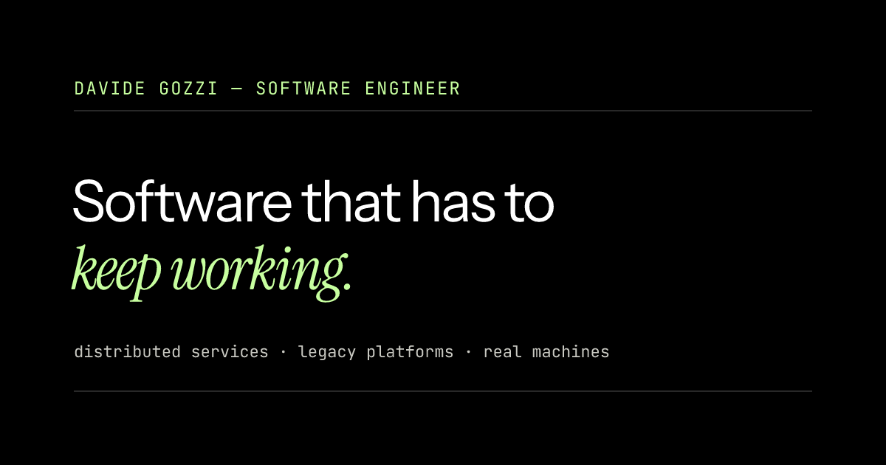

# Davide Gozzi — Engineering Portfolio

[Live portfolio](https://g4solio.github.io/portfolio/) ·
[CV](https://g4solio.github.io/portfolio/Davide_Gozzi_CV.pdf) ·
[LinkedIn](https://www.linkedin.com/in/davide-gozzi5/) ·
[GitHub](https://github.com/g4solio)



An industrial-editorial portfolio about software that has to keep working:
distributed services, legacy platforms, document systems, and applications
connected to real machines.

The site presents my professional experience as a series of first-person
chapters, with selected engineering decisions expanded into concise case
studies. OSUS closes the page as an independent product and engineering lab.

## What is inside

- Six professional chapters, from Unity development during high school to
  industrial software consulting.
- Four engineering notes covering real-time collision prediction,
  configuration-driven document schemas, backward-compatible distributed
  execution, and industrial quality data.
- A short account of how I use AI-assisted development to extend my range
  without outsourcing technical judgment.
- OSUS projects, led by a live preview of RosettAI.
- A downloadable one-page CV and a verifiable EF SET English certificate.

## Design direction

The visual system pairs a Bending Spoons-inspired canvas with the engineering
casebook underneath:

- black ground with high-contrast white typography;
- oversized display type with tight, negative tracking;
- one lime accent, reserved for dark backgrounds, plus serif-italic emphasis;
- a single inverted light band (OSUS) that echoes the dark→light section flip;
- pill-shaped calls to action;
- diagrams used to explain decisions, not decorate the page;
- restrained motion with no scroll hijacking.

Accessibility is a hard constraint: every text/background pair clears WCAG AA
(most clear AAA), focus states are always visible, and the lime accent is never
placed on light surfaces where it would fail contrast.

The opening boot sequence lasts roughly 1.3 seconds, runs once per browser
session, is immediately skippable, and morphs into the page header.

## Technology

- Next.js and React
- TypeScript
- Anime.js for progressive motion
- Static export
- GitHub Actions and GitHub Pages
- Self-hosted Instrument Sans, Instrument Serif, and JetBrains Mono fonts

The project has no backend dependency and requires no runtime secrets.

## Run locally

```bash
npm ci
npm run dev
```

Open `http://localhost:3000`.

## Quality checks

```bash
npm run lint
npm run build
```

The production build is exported to `out/`.

Regenerate the Open Graph image with:

```bash
npm run og
```

## Deployment

The workflow in `.github/workflows/deploy-pages.yml` builds and publishes the
static export whenever `main` is updated.

GitHub Pages must use **GitHub Actions** as its publishing source.

`next.config.ts` derives the correct `basePath` and `assetPrefix` from
`GITHUB_REPOSITORY`, allowing the same project to work as either a user site or
a repository site.

## Project map

```text
app/
  fonts/                  self-hosted variable fonts
  globals.css             visual system and responsive layout
  layout.tsx              metadata and social preview configuration

components/
  BootSequence.tsx        session boot and wordmark hand-off
  Chapters.tsx            professional chapter layouts
  PortfolioPage.tsx       page structure and main copy
  Schematic.tsx           inline engineering diagrams

data/
  portfolio.ts            experience, decisions, and OSUS project data

public/
  Davide_Gozzi_CV.pdf     downloadable one-page CV
  og.png                  social preview image

scripts/
  og.mjs                  Open Graph image generator
```

## Accessibility and resilience

- Semantic HTML and a skip link.
- Native `<details>` and `<summary>` for expandable engineering notes.
- Full keyboard navigation.
- `prefers-reduced-motion` support.
- No content is gated behind animation.
- Without JavaScript, the complete page remains readable and the boot overlay
  does not appear.
- Fonts are self-hosted and make no external requests.

## Content principles

The portfolio intentionally avoids invented metrics and exaggerated ownership.

Professional diagrams are reconstructed to explain engineering decisions
without exposing client source code, confidential infrastructure, credentials,
or internal data. Client and product names are used only where cleared for
public presentation.

The EF SET credential is described precisely as **C2 English comprehension**;
the linked certificate covers reading and listening.

## License

Copyright © 2026 Davide Gozzi. All rights reserved.

The repository is public for review and portfolio transparency. No license is
granted for reuse of its source code, design, writing, diagrams, or other
content unless explicitly agreed in writing.
